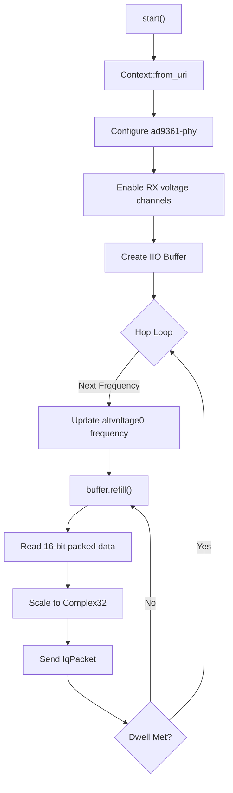

# Design: ADALM-Pluto Interface (orecchiette-sdr-pluto-rs)

This document outlines the architecture of the `orecchiette-sdr-pluto-rs` crate, which provides hardware integration for the Analog Devices ADALM-Pluto (PlutoSDR) using the Linux Industrial I/O (IIO) framework.

## 1. Introduction

The PlutoSDR is a full-duplex, low-cost SDR. Instead of a custom library, it exposes its configuration and streaming interfaces via the standard Linux IIO subsystem. This crate utilizes the `industrial-io` Rust wrapper around `libiio`, enabling high-speed IQ capture over both USB (via RNDIS) and Gigabit Ethernet adapters.

## 2. System Architecture

The architecture maps abstract `SdrSource` operations directly to IIO device attributes and buffers.

### IIO Device Mapping
- **`ad9361-phy`**: The PHY device used for all hardware configuration. The backend interacts with its `voltage0` channel (direction: Input) to set the `sampling_frequency`, `rf_bandwidth`, and `hardwaregain`. The LO (Local Oscillator) frequency is controlled via the `altvoltage0` (direction: Output) channel.
- **`cf-ad9361-lpc`**: The AXI ADC capture device. The backend enables its `voltage0` (I) and `voltage1` (Q) channels, then creates an IIO `Buffer` to stream data into user space.

### Fast Channel Hopping
Unlike other backends that must tear down streams to retune, the PlutoSDR supports on-the-fly retuning. The capture loop simply writes a new frequency integer to the `altvoltage0` `frequency` attribute while the `cf-ad9361-lpc` buffer remains active, resulting in extremely fast channel hops.

## 3. Signal Processing & Overrun Detection

### IQ Scaling
Data is retrieved from the IIO buffer as 16-bit integers, though the AD9361 ADC is 12-bit. The values are padded and stored left-aligned. The capture loop iterates over the I and Q slices, scaling each value by dividing by `2048.0` to produce a `Complex32` in the `[-1.0, 1.0)` range.

### Time-Gap Overrun Heuristic
`libiio`'s `refill()` function abstracts kernel ring buffers but lacks a native, high-level API for exposing hardware dropped-sample metadata. To detect overruns caused by USB/Network lag or slow processing:
- The backend measures the wall-clock time elapsed between successive `refill()` calls.
- It calculates an `expected_duration` based on the sample rate and the buffer size (32,768 samples).
- If the elapsed time exceeds the duration of 3 buffers, it infers that the kernel's ring buffer (typically holding 4 buffers) has overflowed.
- The `overrun` flag is dynamically set to `true` on the resulting `IqPacket`, alerting the downstream orchestrator.

